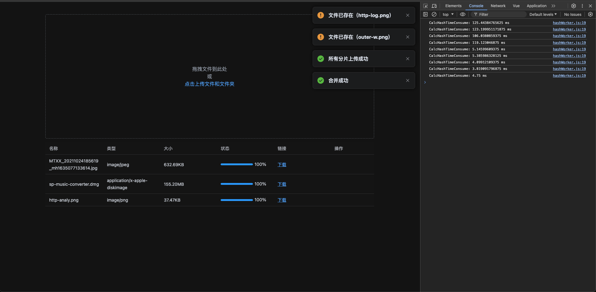

# 主要功能

- 多选文件
- 拖拽上传
- 文件信息分片
- 增量计算文件 hash (在 web worker 中)
- 验证文件 (是否存在/分片是否上传完毕)
- 并发上传
- 合并文件
- 文件上传进度
- 断点续传(暂停/继续)
- 取消上传

# 前端(./client)

- Vue3
- Web Worker

# 后端(./server)

- express

# 功能预览

# 主要逻辑

